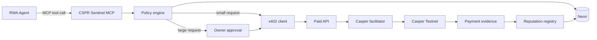

# CSPR Sentinel

CSPR Sentinel is a policy-controlled payment and reputation layer for autonomous AI agents on Casper. It exposes an MCP server that lets agents discover paid services, request x402 purchases, wait for human approval when required, and build bilateral reputation from verifiable outcomes.

- Live demo: [cspr-sentinel.vercel.app](https://cspr-sentinel.vercel.app)
- MCP endpoint: `https://cspr-sentinel.vercel.app/api/mcp`
- Facilitator discovery: [embedded `/supported` endpoint](https://cspr-sentinel.vercel.app/api/facilitator/supported)
- Source: [github.com/yi-dong-z/cspr-sentinel](https://github.com/yi-dong-z/cspr-sentinel)

The included RWA diligence agent demonstrates the full flow with synthetic commercial paper data:

1. It buys a low-cost asset verification service automatically.
2. It sends a higher-cost risk intelligence request to the owner approval queue.
3. After approval, the request is paid and delivered.
4. The application stores the Casper transaction hash and anchors reputation aggregates on-chain.

> The provider datasets are synthetic and are not investment, legal, or compliance advice.

## Why it exists

Agents need the ability to pay for one API call at a time, but unrestricted signing keys are unsafe. CSPR Sentinel separates planning from authority. The model can request a purchase; deterministic policy code decides whether it is denied, executed, or held for owner approval.

## Architecture



## Monorepo

- `apps/web`: Next.js dashboard, API routes, paid provider endpoints, x402 and contract adapters.
- `packages/core`: policy engine, purchase state machine, reputation formulas, Neon repository.
- `packages/mcp`: five MCP tools over Streamable HTTP.
- `packages/agent`: Anthropic RWA planner and deterministic fallback.
- `contracts/reputation`: Odra contract for counters, payment receipts, and rating uniqueness.

## MCP tools

| Tool | Purpose |
| --- | --- |
| `list_services` | Filter paid APIs by category, price, and provider reputation. |
| `request_purchase` | Run policy checks and auto-pay or create an approval. |
| `get_purchase_status` | Read policy, approval, payment, delivery, and evidence state. |
| `submit_provider_rating` | Submit one verified-buyer rating per delivered purchase. |
| `get_reputation` | Read agent or provider score, counters, label, and chain anchor. |

Purchase states are `requested`, `policy_denied`, `pending_approval`, `approved`, `paying`, `settled`, `delivered`, and `failed`.

## Local development

Requirements: Node.js 20 or newer and pnpm 10.

```bash
cp .env.example apps/web/.env.local
pnpm install
pnpm dev
```

Open [http://localhost:3000](http://localhost:3000). The default `DEMO_MODE=true` uses simulated deploy hashes and clearly labels the interface as Simulation mode. Anthropic is optional in this mode; without a key, a deterministic planner creates the same two-service diligence plan.

Run verification:

```bash
pnpm typecheck
pnpm test
pnpm security:scan
pnpm build
```

## Neon persistence

Set `DATABASE_URL`, apply the included Drizzle migration, then start the app:

```bash
pnpm db:migrate
pnpm dev
```

Without `DATABASE_URL`, the app uses a process-local memory repository suitable for the interactive demo and tests.

## GitHub owner access

Set `GITHUB_ID`, `GITHUB_SECRET`, `NEXTAUTH_SECRET`, and `OWNER_GITHUB_LOGIN`. Only the allow-listed GitHub login can create approval decisions in production. A matching `x-demo-admin-key` header is also accepted for controlled API automation. MCP, direct purchase, and rating requests use the separate `x-agent-api-key` header.

## Casper Testnet mode

Follow [docs/TESTNET.md](docs/TESTNET.md). Real mode requires a funded agent wallet, WCSPR, the official Casper x402 facilitator, two provider payees, and the deployed reputation contract.

When all variables are set, change `DEMO_MODE=false`. The runtime then:

- creates EIP-712 payment authorizations with `@make-software/casper-x402`;
- settles through the configured facilitator;
- stores the returned Casper transaction hash;
- calls `record_purchase` and `record_provider_rating` on the reputation contract.

Private keys are read only from server environment variables. They are never returned by an API, stored in Neon, or shipped to the browser.

Before starting real mode, validate every required setting and probe the Casper RPC and facilitator:

```bash
pnpm testnet:preflight
```

Real mode fails closed: an incomplete x402 or reputation configuration will stop the request instead of silently producing simulated transaction hashes.

## Deployment

The public deployment runs on Vercel with Neon PostgreSQL persistence. It intentionally remains in clearly labelled simulation mode until the generated testnet wallets receive CSPR/WCSPR and the reputation contract is deployed; `DEMO_MODE=false` is the explicit cutover switch.

1. Create a Neon database and apply the migration.
2. Import this repository into Vercel with root directory `apps/web`.
3. Add the environment variables from `.env.example`.
4. Set `NEXT_PUBLIC_APP_URL` to the deployed origin.
5. Add the production OAuth callback URL to the GitHub OAuth app.
6. Verify `/api/state`, `/api/mcp`, one auto-payment, and one approval payment.

Vercel and external monitors can use `/api/health`. It returns HTTP 503 when real mode is incomplete, without exposing secret values. GitHub Actions verifies the TypeScript application, security scan, Odra tests, and a reproducible optimized contract WASM build.

## Reputation model

- Provider: 60% verified buyer rating and 40% delivery success.
- Agent: 50% payment success, 30% policy compliance, and 20% approval acceptance.
- New subjects start at `50 / Unproven`.
- Crossing an automatic threshold is compliant; exceeding a hard allow-list, quote, reputation, or daily-budget rule is not.
- Score weights live in the application. Raw aggregates and payment evidence live in the contract so weights can evolve without migrating history.

## References

- [Casper x402](https://github.com/make-software/casper-x402)
- [CSPR.cloud MCP server](https://docs.cspr.cloud/agentic-tools/mcp-server)
- [Odra documentation](https://odra.dev/docs/)

Licensed under Apache-2.0.
